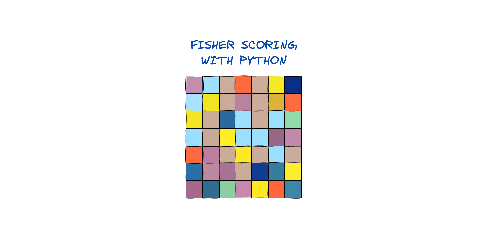

# Fisher Scoring with Python

**Author:** [xRiskLab](https://github.com/xRiskLab)<br>
**Version:** v2.0<br>
**License:** [MIT License](https://opensource.org/licenses/MIT) (2024)



This repository contains optimized Python implementations of the Fisher Scoring algorithm for various logistic regression models. With version 2.0, the core algorithms are now significantly faster due to optimized matrix operations and reduced memory usage, providing faster convergence for larger datasets.

```python
%pip install fisher-scoring
from fisher_scoring import FisherScoringLogisticRegression

# Initialize and fit model
model = FisherScoringLogisticRegression(epsilon=1e-5)
model.fit(X_train, y_train)

# Make predictions
predictions = model.predict(X_test)
probabilities = model.predict_proba(X_test)
```

## Overview

### Introduction

This repository contains a Python package with scikit-learn compatible implementations of the Fisher Scoring algorithm for various logistic regression use cases:

1. Binary classification problems: **Logistic Regression**.
2. Multi-class classification problems: **Multinomial Logistic Regression**.
3. Imbalanced classification problems: **Focal Loss Logistic Regression**.

### Fisher Scoring Algorithm

The Fisher Scoring algorithm is an iterative optimization technique that estimates maximum likelihood estimates by leveraging the expected or observed Fisher information matrix. This second-order optimization method allows to avoid the use of learning rates and provides more stable convergence compared to gradient descent.

There are two types of information matrices used in the Fisher Scoring algorithm:

* **Observed Information Matrix**: Uses ground truth labels to calculate the information matrix, often resulting in more reliable inference metrics.
* **Expected Information Matrix**: Relies on predicted probabilities, providing an efficient approximation for the information matrix.

These information matrices are used to derive standard errors of estimates to calculate detailed model statistics, including Wald statistics, p-values, and confidence intervals at a chosen level.

### Implementation Notes

- **Fisher Scoring Multinomial Regression**  
  The `FisherScoringMultinomialRegression` model differs from standard statistical multinomial logistic regression by using all classes rather than \( K - 1 \). This approach allows multi-class classification problems to be converted to binary problems by calculating \(1 - probability of the target class).

- **Fisher Scoring Focal Regression**  
  The `FisherScoringFocalRegression` class employs a non-standard log-likelihood function in its optimization process.

  The focal loss function, originally developed for object detection, prioritizes difficult-to-classify examples—often the minority class—by reducing the contribution of easy-to-classify samples. It introduces a focusing parameter, *gamma*, which down-weights the influence of easily classified instances, thereby concentrating learning on challenging cases.

  Source: [Focal Loss for Dense Object Detection](https://arxiv.org/abs/1708.02002).


## Models

### Fisher Scoring Logistic Regression

The `FisherScoringLogisticRegression` class is a custom implementation of logistic regression using the Fisher scoring algorithm. It provides methods for fitting the model, making predictions, and computing model statistics, including standard errors, Wald statistics, p-values, and confidence intervals.

**Parameters:**
- `epsilon`: Convergence threshold for the algorithm.
- `max_iter`: Maximum number of iterations for the algorithm.
- `information`: Type of information matrix to use ('expected' or 'observed').
- `use_bias`: Include a bias term in the model.
- `significance`: Significance level for computing confidence intervals.

**Methods:**
- `fit(X, y)`: Fit the model to the data.
- `predict(X)`: Predict target labels for input data.
- `predict_proba(X)`: Predict class probabilities for input data.
- `get_params()`: Get model parameters.
- `set_params(**params)`: Set model parameters.
- `summary()`: Get a summary of model parameters, standard errors, p-values, and confidence intervals.
- `display_summary()`: Display a summary of model parameters, standard errors, p-values, and confidence intervals.

### Fisher Scoring Multinomial Regression

The `FisherScoringMultinomialRegression` class implements the Fisher Scoring algorithm for multinomial logistic regression, suitable for multi-class classification tasks.

**Parameters:**
- `epsilon`: Convergence threshold for the algorithm.
- `max_iter`: Maximum number of iterations for the algorithm.
- `information`: Type of information matrix to use ('expected' or 'observed').
- `use_bias`: Include a bias term in the model.
- `significance`: Significance level for computing confidence intervals.
- `verbose`: Enable verbose output.

**Methods:**
- `fit(X, y)`: Fit the model to the data.
- `predict(X)`: Predict target labels for input data.
- `predict_proba(X)`: Predict class probabilities for input data.
- `summary(class_idx)`: Get a summary of model parameters, standard errors, p-values, and confidence intervals for a specific class.
- `display_summary(class_idx)`: Display a summary of model parameters, standard errors, p-values, and confidence intervals for a specific class.

The algorithm is in a beta version and may require further testing and optimization to speed up matrix operations.

### Fisher Scoring Focal Loss Regression

The `FisherScoringFocalRegression` class implements the Fisher Scoring algorithm with focal loss, designed for imbalanced classification problems where the positive class is rare.

**Parameters:**
- `gamma`: Focusing parameter for focal loss.
- `epsilon`: Convergence threshold for the algorithm.
- `max_iter`: Maximum number of iterations for the algorithm.
- `information`: Type of information matrix to use ('expected' or 'observed').
- `use_bias`: Include a bias term in the model.
- `verbose`: Enable verbose output.

*Note*: The algorithm does not have a summary method for model statistics implemented yet.


## Installation

To use the models, clone the repository and install the required dependencies.

```bash
git clone https://github.com/xRiskLab/fisher-scoring.git
cd fisher-scoring
pip install -r requirements.txt
```

## Change Log

- **v2.0**
  - **Performance Improvements**: Performance Enhancements: Optimized matrix calculations for substantial speed and memory efficiency improvements across all models. Leveraging streamlined operations, this version achieves up to 290x faster convergence. Performance gains per model:
    - *Multinomial Logistic Regression*: Training time reduced from 125.10s to 0.43s (~290x speedup).
    - *Logistic Regression*: Training time reduced from 0.24s to 0.05s (~5x speedup).
    - *Focal Loss Logistic Regression*: Training time reduced from 0.26s to 0.01s (~26x speedup).
  - **Bug Fixes**: `verbose` parameter in Focal Loss Logistic Regression now functions as expected, providing accurate logging during training.

- **v0.1.4**
  - Updated log likelihood for Multinomial Regression and minor changes to Logistic Regression for integration with scikit-learn.

- **v0.1.3**
  - Added coefficients, standard errors, p-values, and confidence intervals for Multinomial Regression.

- **v0.1.2**
  - Updated NumPy dependency.

- **v0.1.1**
  - Added support for Python 3.9+ 🐍.

- **v0.1.0**
  - Initial release of Fisher Scoring Logistic, Multinomial, and Focal Loss Regression.
